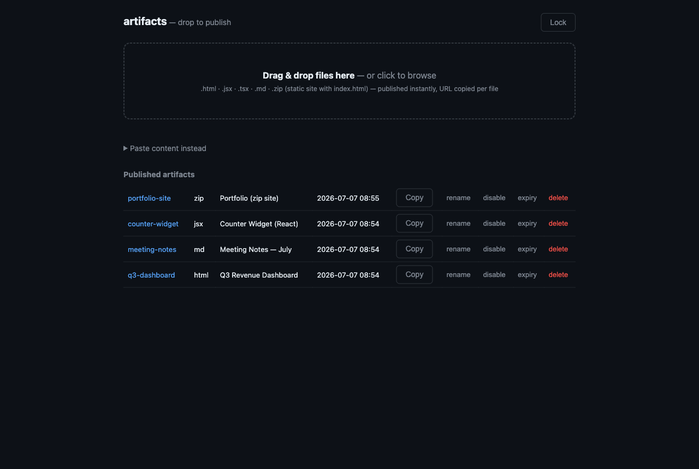

<h1 align="center">artifacts</h1>

<p align="center">
  <strong>Self-hosted, Claude-style artifact publishing</strong>
</p>

<p align="center">
  POST HTML, a React component, Markdown, or a zipped static site — get back an unguessable URL on your own domain.
</p>

<p align="center">
  <a href="https://github.com/kuyazee/artifacts/actions/workflows/ci.yml"></a>
  <a href="LICENSE"></a>
  <a href="package.json">= 22"></a>
</p>

<p align="center">
  <a href="#quick-start">Quick start</a> ·
  <a href="docs/deploy.md">Deploy</a> ·
  <a href="docs/api.md">API</a> ·
  <a href="docs/cli.md">CLI</a> ·
  <a href="docs/mcp.md">MCP</a> ·
  <a href="SECURITY.md">Security</a>
</p>



## About

AI assistants generate a lot of shareable output — dashboards, prototypes, reports, small apps. Claude's hosted artifacts work well, but the URLs live on someone else's infrastructure. This is the ~600-line self-hosted version: you POST content, it serves the rendered result at an unguessable URL on a domain you control.

It runs as one container with no database and no accounts. Each artifact is a directory of plain files under `/data` — back up that directory and you have backed up everything. Need durability on a host that wipes local disk on restart? Point it at any S3-compatible bucket with `STORAGE_BACKEND=s3` (see [deploying](docs/deploy.md#storage-backends)).

## Features

- **Four content types.** HTML, JSX/TSX (a single React component, no build step), Markdown, and zipped static sites.
- **Agent-native, human-friendly.** A built-in MCP server lets Claude Code, Codex, or any MCP client publish with one tool call. Humans get a drag-and-drop web UI at `/` (locked behind the API key) and a [CLI](docs/cli.md).
- **Private by default.** Unguessable slugs, `noindex` everywhere, bearer-key writes, optional expiry.
- **Lifecycle controls.** Custom slugs, rename, tags (click a tag in the UI to filter), disable without deleting, auto-expire, delete.

## Quick start

Clone, configure, start:

```bash
git clone https://github.com/kuyazee/artifacts && cd artifacts
cp .env.example .env   # set ARTIFACTS_API_KEY (openssl rand -hex 32) and BASE_URL
docker compose up -d
```

Publish something:

```bash
curl -s -X POST https://artifacts.example.com/api/artifacts \
  -H "Authorization: Bearer $ARTIFACTS_API_KEY" \
  -H "Content-Type: application/json" \
  -d '{"content": "<h1>hello</h1>", "type": "html", "slug": "hello", "tags": ["demo"]}'
# {"slug":"hello","url":"https://artifacts.example.com/a/hello"}
```

Let Claude Code publish for you:

```bash
claude mcp add --transport http artifacts https://artifacts.example.com/mcp \
  --header "Authorization: Bearer ${ARTIFACTS_API_KEY}" --scope user
```

## Documentation

| I want to… | Read |
|---|---|
| Deploy it (Docker, compose, Coolify, bare node, env vars) | [docs/deploy.md](docs/deploy.md) |
| Use the REST API (incl. zip sites and tags) | [docs/api.md](docs/api.md) |
| Publish from the terminal | [docs/cli.md](docs/cli.md) |
| Hook up Claude Code / Codex / any agent | [docs/mcp.md](docs/mcp.md) |
| Understand JSX/TSX rendering + zip validation | [docs/formats.md](docs/formats.md) |

## Development

No build step. Node ≥ 22.

```bash
npm install
cp .env.example .env   # any ARTIFACTS_API_KEY works locally, e.g. "test"
npm run dev
# UI at http://localhost:3000
```

The whole test suite is one shell script:

```bash
bash .github/workflows/smoke.sh http://localhost:3000 <your-key>
```

PRs welcome — see [CONTRIBUTING.md](CONTRIBUTING.md).

## Security in three lines

Uploaded HTML executes — that's the product — so host it on a dedicated subdomain that never sets cookies. Writes are bearer-header-only; hosted JS can't CSRF them. Reads are public but gated by unguessable, non-indexed slugs — don't publish secrets. Full model in [SECURITY.md](SECURITY.md).

## License

[MIT](LICENSE) © 2026 Zonily Jame

<p align="center">
  <sub>One container, no database. Artifacts are plain files.</sub>
</p>
